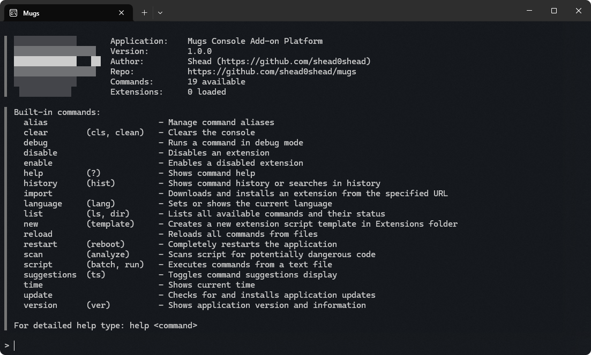

# Mugs - Extensible Console Utility

Mugs is a powerful console utility with support for dynamic command loading through C# scripts. The program provides a convenient environment for executing built-in and custom commands with features like localization, automatic updates, and a security system.



## Key Features

* **Dynamic command loading** from `.csx` and `.cs` files  
* **Built-in commands** for system management  
* **Localization support** with the ability to add new languages  
* **Automatic updates** via GitHub Release  
* **Security system** with script checks for dangerous code  
* **Command hints** with auto-completion  
* **Command history** with search functionality  
* **Command aliases** for quick access  
* **Batch execution** of commands from files  
* **Command debugging** with execution time output  
* **Metadata caching** for fast command loading  
* **Verified extensions** with hash verification  

## Installation

1. Download the latest version from the [Releases section](https://github.com/shead0shead/mugs/releases)  
2. Extract the archive to a convenient directory  
3. Run `Mugs.exe`  

## Usage

After launching, you will see a welcome message. Type `help` to view the list of available commands.  

## Basic Commands

* `help` - Show command help  
* `list` - List all available commands  
* `reload` - Reload all commands  
* `clear` - Clear the console  
* `restart` - Fully restart the application  
* `time` - Show the current time  
* `update` - Check for and install updates  
* `new <name>` - Create a template for a new command  
* `enable/disable <command>` - Enable/disable an extension  
* `import <url>` - Install an extension from a URL  
* `language <code>` - Change the interface language  
* `script <file>` - Execute commands from a file  
* `suggestions` - Enable/disable command hints  
* `alias` - Manage command aliases  
* `scan <file>` - Check a script for dangerous code  
* `history` - Show command history  
* `version` - Show the application version  
* `debug <command>` - Run a command in debug mode  

## Creating Custom Commands

1. Use the command `new mycommand` to create a template  
2. Edit the file `Extensions/mycommand.csx`  
3. Run `reload` to apply the changes  

Example of a simple command:  

```csharp
public class MyCommand : ICommand
{
    public string Name => "mycommand";
    public string Description => "My custom command";
    public IEnumerable<string> Aliases => new[] { "mc" };
    public string Author => "Your Name";
    public string Version => "1.0";
    public string? UsageExample => "mycommand arg1 arg2";

    public async Task ExecuteAsync(string[] args)
    {
        Print($"Command executed with args: {string.Join(", ", args)}");
    }
}

// Return command instance
new MyCommand()
```

## Security

The program includes a script verification system:

* Automatic checks for dangerous calls (scan command)
* Verified extensions system (marked with a ✅ icon)
* Ability to disable suspicious scripts
* File hash verification for verified commands

## Localization

Multiple languages are supported. The current language can be changed using the `language` command. Available languages:

* en (English) - default
* ru (Русский)

To add a new language, create a file `Languages/<code>.json` based on the English localization.

## License

The project is distributed under the MIT license. For details, see the LICENSE file.

## Support and Contributions

Bug reports and feature requests can be submitted in Issues. Pull requests are welcome!

## System Requirements

* .NET 6.0 or higher
* Windows 7/10/11 or Linux/macOS (with Mono)
* 50 MB of free disk space